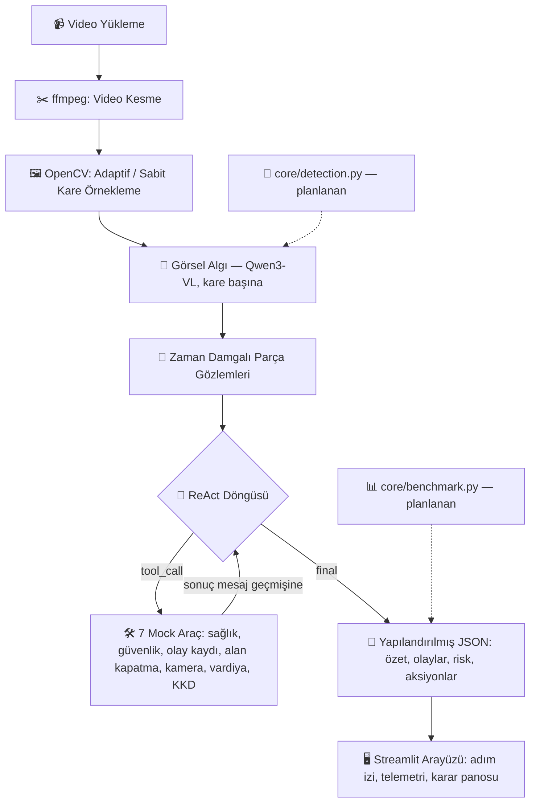

# 🛸 TEKNOFEST 2026 Yapay Zeka Dil Ajanları Yarışması
## Senaryo 3: Video Analiz ve Operasyonel Karar Destek Ajanı

> **GitHub Etiketi:** `BilisimVadisi2026`
> **Lisans:** Apache License 2.0
> **Çalışma Modu:** %100 Çevrimdışı (Offline) / Yerel (Local)

---

## 📌 Proje Hakkında

Bu proje, savunma sanayii tesisleri ve saha operasyonları için geliştirilmiş **çoklu ortam (multimodal) video analiz ve operasyonel karar destek ajanı** sistemidir.

Sistem bir video girdisini alır, kareleri zamansal akış içinde bir görsel dil modeline (Qwen3-VL) analiz ettirir, ardından **gerçek bir ReAct döngüsü** ile — model gerektikçe araç çağırır, araç sonucunu görür, bir sonraki adıma karar verir — operasyonel aksiyonları (sağlık ekibi çağırma, alan kapatma, olay kaydı vb.) tetikler ve son olarak zaman damgalı olaylar, risk seviyesi ve aksiyon önerileri içeren yapılandırılmış bir Türkçe özet üretir.

Tamamen yerel çalışır: video analizini yapan model kendi makinenizde `llama-server` (llama.cpp) ile servis edilir, hiçbir bulut API'sine veya kapalı servise bağımlılık yoktur.

---

## 🏗️ Sistem Mimarisi



Kesikli çizgili kutular (`detection.py`, `benchmark.py`) henüz boş stub — bkz. [Devam eden çalışma](#-devam-eden-çalışma).

---

## 📂 Proje Yapısı

```
config.py              # Tüm ayarlar — .env'den okunur, hardcoded path yok
core/
  sampler.py             # Video kesme (ffmpeg) + adaptif/sabit kare örnekleme (OpenCV)
  vision.py               # Kare başına görsel analiz — VLM çağrıları, sunucu health check
  agent.py                  # ReAct döngüsü: model ↔ araç çok adımlı zincirleme, final JSON sentezi
  tools.py                    # 7 mock araç + OpenAI-format şemalar + execute_tool dispatcher
  detection.py                  # BOŞ — YOLO tabanlı nesne tespiti (planlı)
  benchmark.py                    # BOŞ — P/R/F1 değerlendirme (planlı)
ui/
  app.py                # Streamlit arayüzü — sadece UI, iş mantığı içermez
scripts/
  test_react.py         # Video beklemeden ReAct döngüsünü hızlı test etme
SETUP.md                # Sıfırdan kurulum kılavuzu (Python, CUDA, llama.cpp derleme, model indirme dahil)
```

---

## ⚡ Hızlı Başlangıç

Aşağıdakiler sadece özet komutlardır. Python/Git/CMake/Visual Studio Build Tools/CUDA kurulumundan model dosyalarının indirilmesine, VRAM'e göre parametre ayarına ve sık karşılaşılan hatalara kadar **adım adım, ekip için yazılmış tam kılavuz için → [`SETUP.md`](./SETUP.md)**.

```powershell
git clone https://gitlab.com/argosturkiyeai/repo.git
cd repo
python -m venv venv
.\venv\Scripts\Activate.ps1
pip install -r requirements.txt
copy .env.example .env
# .env içine kendi MODEL_PATH / MMPROJ_PATH yollarınızı yazın
```

Model sunucusunu ayrı bir terminalde başlatın (`--jinja` zorunlu — tool-calling için gerekli):

```powershell
& "<llama.cpp klasörünüz>\build\bin\Release\llama-server.exe" `
  -m "<MODEL_PATH>" --mmproj "<MMPROJ_PATH>" `
  --host 127.0.0.1 --port 8080 -c 8192 -ub 512 -ngl 20 -fa 1 --jinja
```

Uygulamayı başlatın:

```powershell
streamlit run ui/app.py
```

Video beklemeden ReAct döngüsünü hızlı test etmek için:

```powershell
python scripts\test_react.py
```

---

## 🧠 Model Servisleme

Model servisleme için **llama.cpp (`llama-server`)** kullanılıyor — Qwen3-VL'i GGUF formatında, OpenAI-uyumlu `/v1/chat/completions` API'siyle ve `--jinja` desteğiyle gerçek tool-calling (function calling) sunuyor.

Şartname `vLLM veya benzeri yerel model servisleme altyapısı` istiyor; vLLM yerine llama.cpp tercih edilme gerekçesi:
- **Windows'ta yerel derleme/çalıştırma desteği** (ekibin geliştirme ortamı Windows) — vLLM'in Windows desteği sınırlı.
- **GGUF kuantizasyon ekosistemi** — düşük VRAM'li kartlarda (6 GB gibi) modeli çalıştırılabilir kılan Q4_K_M/Q8_0 gibi kuantizasyonlara doğrudan erişim.
- **`--jinja` ile tool-calling** — OpenAI-format `tools` parametresini doğru şekilde işleyip yapılandırılmış `tool_calls` üretebiliyor, bu projenin ReAct döngüsünün temel bağımlılığı.

---

## 🛠️ Araçlar (Mock Tools)

Ajan, ReAct döngüsü sırasında aşağıdaki 7 aracı gerçek OpenAI-format function-calling ile (`core/tools.py`) çağırabilir. Her araç gerçekçi bir mock sonuç (bilet numarası, ETA, onaylanmış aksiyon vb.) döndürür, sonuç mesaj geçmişine geri beslenir:

| Araç | Ne yapar |
|---|---|
| `mock_saglik_ekibi_cagir` | Yaralanma/acil durumda sağlık ekibi çağırır (konum, aciliyet) |
| `mock_guvenlik_alert_ver` | Güvenlik ihlali/tehlikede güvenlik birimini uyarır (seviye) |
| `mock_olay_kaydi_olustur` | Kaza/olay/kural ihlali için kayıt oluşturur (olay tipi) |
| `mock_alan_kapat` | Tehlikeli bölgeyi belirli süreliğine kapatır |
| `mock_kamera_yonlendir` | Sahadaki bir kamerayı hedef bölgeye yönlendirir |
| `mock_vardiya_amirine_bildir` | Vardiya amirine öncelikli mesaj iletir |
| `mock_kkd_ihlali_raporla` | Kişisel koruyucu donanım ihlalini raporlar (kişi sayısı, ihlal tipi) |

`execute_tool()` dispatcher'ı hiçbir zaman exception fırlatmaz: bilinmeyen araç adı, eksik/hatalı-tipli argüman ya da aynı aracın aynı argümanlarla tekrarı, modelin okuyup düzeltebileceği açıklayıcı bir hata dict'i olarak geri döner.

---

## 🔁 ReAct Döngüsü — Dayanıklılık Garantileri

`core/agent.py`'deki döngü, modelin çok adımlı araç zincirlemesini (bir aracın sonucuna bakıp bir sonrakini tetiklemesini) sağlarken şu durumları da yönetir:

- **İterasyon limiti** (`config.MAX_REACT_ITERATIONS`, varsayılan 5) dolarsa, o ana kadar toplanan adım izini döner ve bunu açık bir `iteration_limit_reached` bayrağıyla işaretler — **asla sahte bir "tamamlandı" cevabı üretmez.**
- **Zaman aşımı**: model sunucusu yanıt vermezse 2 kez daha dener, üçü de başarısız olursa temiz bir şekilde durur (`aborted` + sebep).
- **Tekrar koruması**: aynı araç aynı argümanlarla tekrar çağrılırsa (zaten başarıyla çalıştıysa) reddedilir, modele bunu tekrar yapmasına gerek olmadığı söylenir.
- **Bozuk JSON argümanı**: model geçersiz JSON argüman gönderirse döngü çökmez, hata mesaj geçmişine geri beslenir.
- **Bozuk final JSON**: model son cevabında geçersiz JSON üretirse `json_repair` ile (veri uydurulmadan) onarılmaya çalışılır; onarılamazsa açık bir hata döner, arayüzde ham çıktı gösterilir.

---

## 📄 Çıktı JSON Formatı

```json
{
  "summary": "Videoda forklift kazası ve yaralanma riski gözlenmiştir.",
  "events": [
    {"time": "00:15", "event": "Forklift devrildi"},
    {"time": "00:20", "event": "Yerde hareketsiz kişi"}
  ],
  "risk": "Yüksek",
  "actions": [
    "Sağlık ekibini çağır",
    "Alanı güvenlik altına al"
  ],
  "telemetry_metrics": {
    "cut_time": 0.12,
    "extract_time": 0.45,
    "vision_time": 12.30,
    "agg_time": 2.10,
    "total_time": 14.97,
    "throughput_fps": 1.3
  }
}
```

Gerçekte tetiklenen araç çağrıları (hangi araç, hangi argümanlarla, hangi sonuçla) bu JSON'da değil, ReAct döngüsünün **adım izinde** (`trace`) tutulur — Streamlit arayüzünde "🔄 ReAct Adım İzi" panelinden görülebilir. Bu, önceki sürümlerdeki `triggered_tools` alanının (araç önerisi ile gerçek çalıştırma arasındaki belirsizlik) yerini alır: artık trace'te görünen her satır gerçekten çalıştırılmıştır.

---

## 🚧 Devam eden çalışma

- **`core/detection.py`** — YOLO tabanlı nesne tespitini (`detect_frame`, `detections_to_text`) görsel algı aşamasına ek bağlam olarak besleyecek. Şu an boş stub.
- **`core/benchmark.py`** — Ground truth klipler üzerinde olay tespiti için P/R/F1 ve tool-call doğruluğu ölçecek (`load_ground_truth`, `run_evaluation`). Şu an boş stub.

---

## 📜 Lisans

Bu proje TEKNOFEST 2026 yarışma kuralları gereğince **Apache License 2.0** ile lisanslanmıştır.
