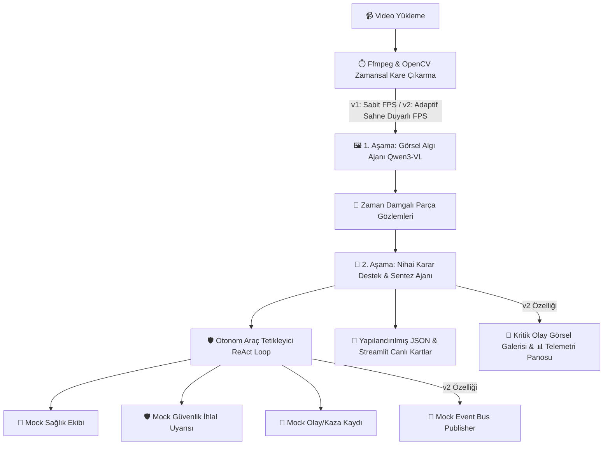

# 🛸 TEKNOFEST 2026 Yapay Zeka Dil Ajanları Yarışması
## Senaryo 3: Video Analiz ve Operasyonel Karar Destek Ajanı

> **GitHub Etiketi:** `BilisimVadisi2026`  
> **Lisans:** Apache License 2.0  
> **Çalışma Modu:** %100 Çevrimdışı (Offline) / Yerel (Local)  

---

## 📌 Proje Hakkında

Bu proje, savunma sanayii tesisleri ve saha operasyonları için geliştirilmiş **Çoklu Ortam (Multimodal) Video Analiz ve Operasyonel Karar Destek Ajanı** sistemidir.

Sistem; video girdilerini zamansal akış içinde analiz eder, kritik olayları zaman damgasıyla (`MM:SS`) tespit eder, risk seviyelerini belirler ve tespit edilen durumlara göre **otonom araçları (Tools - Sağlık Ekibi, Güvenlik Bildirimi, Olay Kaydı)** otonom olarak tetikler.

Projemiz iki farklı versiyona sahiptir:
- **v1 (`teknofest/v1.py`):** Standart Sabit FPS Kare Örneklemeli Temel Versiyon.
- **v2 (`teknofest/v2.py`):** Savant Mimari Fikirleri entegre edilmiş, **Adaptif (Sahne Duyarlı) FPS Örneklemeli**, **Gecikme Telemetri Analizli** ve **Kritik Olay Görsel Galerili** Gelişmiş Versiyon.

---

## ⚡ v1 (`v1.py`) vs v2 (`v2.py`) Farkları ve FPS Karşılaştırması

| Özellik / Kriter | v1 (`teknofest/v1.py`) | v2 (`teknofest/v2.py` - Savant Mimari Entegreli) |
| :--- | :--- | :--- |
| **Kare Örnekleme (FPS) Modu** | **Sabit FPS (Fixed Sampling):** Videoda hareket olsun ya da olmasın sabit zaman aralıklarıyla (örn. her 2 sn'de 1) kare çıkarır. | **Adaptif / Sahne Duyarlı (Adaptive Motion FPS):** OpenCV `cv2.absdiff` ile sahneler arası hareket seviyesini ölçer. Durağan sahnelerde örneklemeyi otomatik 2 kat seyrekleştirir, kaza/hareket anında sıklaştırır. |
| **Vision Token ve Çıkarım Hızı** | Yüksek sayıda sabit kare işlendiği için Vision Token harcaması yüksektir. | Durağan kareleri eleyerek **Vision Token sayısını %40-%60 oranında azaltır** ve **çıkarım hızını yaklaşık 2 katına çıkarır**. |
| **Performans & Telemetri İzleme** | Yalnızca toplam analiz süresi gösterilir. | **Savant Tarzı Telemetri Panosu:** Video Kırpma ($T_{cut}$), Kare Çıkarma ($T_{extract}$), Görsel AI ($T_{vision}$), Karar Sentez ($T_{agg}$), Uçtan Uca Süre ($T_{total}$) ve FPS Hızı anlık ölçülür. |
| **Kritik Olay Görsel Vurgulayıcı** | Sadece metinsel olay listesi sunulur. | **Thumbnail Highlights:** Olay tespit edilen anların (`00:15`) karesini otomatik resim önizleme kartı olarak sergiler. |
| **Çoklu Sistem Yayıncısı (Event Bus)** | Sadece dahili Streamlit log kaydı tutar. | **Mock Event Bus:** Tetiklenen araçları harici sistemlere (kuyruk/webhook mock) JSON yayıncısı olarak iletir. |

---

## 🏗️ Sistem Mimarisi



---

## 🛠️ Başlatma Talimatları ve Komutlar

### 1. Adım: Model Sunucusunun Başlatılması (`llama-server`)

Modeller %100 çevrimdışı (offline) ve yerel olarak `llama-server` ile çalıştırılır. Aşağıdaki komutu ayrı bir terminalde çalıştırın:

```bash
/home/rabia/llama.cpp/build_120a/bin/llama-server \
  -m /home/rabia/llama.cpp/models/Qwen3-VL-8B/Qwen3VL-8B-Instruct-Q8_0.gguf \
  --mmproj /home/rabia/llama.cpp/models/Qwen3-VL-8B/mmproj-Qwen3VL-8B-Instruct-Q8_0.gguf \
  --host 127.0.0.1 \
  --port 8080 \
  -c 24576 \
  -ub 4096 \
  -np 2 \
  -ngl 28 \
  -fa 1
```

---

### 2. Adım: Kullanıcı Arayüzünün Başlatılması

Bulunduğunuz dizine göre komutu çalıştırabilirsiniz:

#### 🟢 Ana Proje Dizininden (`/home/rabia/llama.cpp`):
```bash
# Versiyon 1 (Standart):
streamlit run teknofest/v1.py

# Versiyon 2 (Savant Mimari & Adaptif FPS):
streamlit run teknofest/v2.py
```

#### 🟢 `teknofest` Klasörü İçinden (`/home/rabia/llama.cpp/teknofest`):
```bash
cd teknofest

# Versiyon 1:
streamlit run v1.py

# Versiyon 2:
streamlit run v2.py
```

---

## 📊 Benchmark ve Ölçümleme (KPI)

Şartnamenin 4. ve 7. maddelerine uygun olarak sistemin gecikme süresini (latency) ve doğru araç tetikleme metriklerini test etmek için:

```bash
python3 teknofest/benchmark.py
```
Ölçüm raporu otomatik olarak `teknofest/Kod/benchmark_report.json` dosyasına işlenecektir.

---

## 📄 Çıktı JSON Formatı (`analiz_sonucu_v2.json`)

```json
{
  "summary": "Videoda kaza ve yaralanma riski tespit edilmiştir.",
  "events": [
    {"time": "00:15", "event": "Forklift devrilmesi"},
    {"time": "00:20", "event": "Yerde hareketsiz kişi"}
  ],
  "risk": "Kritik",
  "actions": [
    "Sağlık ekibini bölgeye yönlendirin"
  ],
  "triggered_tools": [
    {
      "tool_name": "mock_saglik_ekibi_cagir",
      "args": {"detay": "00:20'deki hareketsiz kişi için acil çağrı"}
    }
  ],
  "telemetry_metrics": {
    "cut_time": 0.12,
    "extract_time": 0.45,
    "vision_time": 12.30,
    "agg_time": 2.10,
    "total_time": 14.97,
    "throughput_fps": 1.3
  }
}
```

---

## 📜 Lisans

Bu proje TEKNOFEST 2026 yarışma kuralları gereğince **Apache License 2.0** ile lisanslanmıştır.
